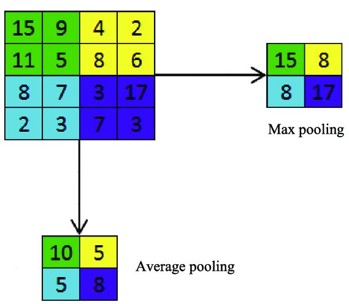
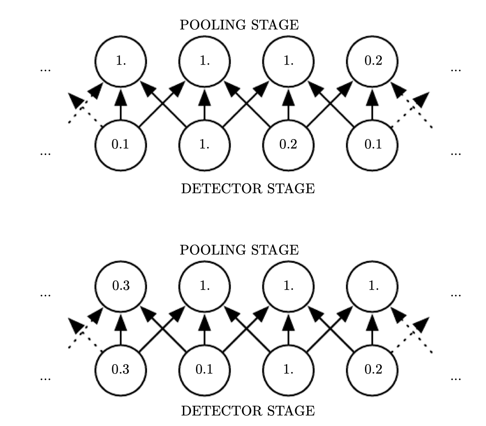
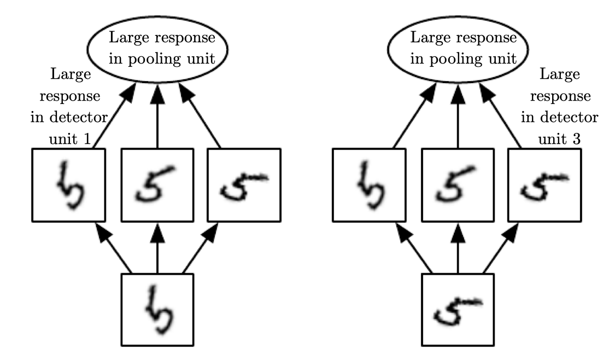
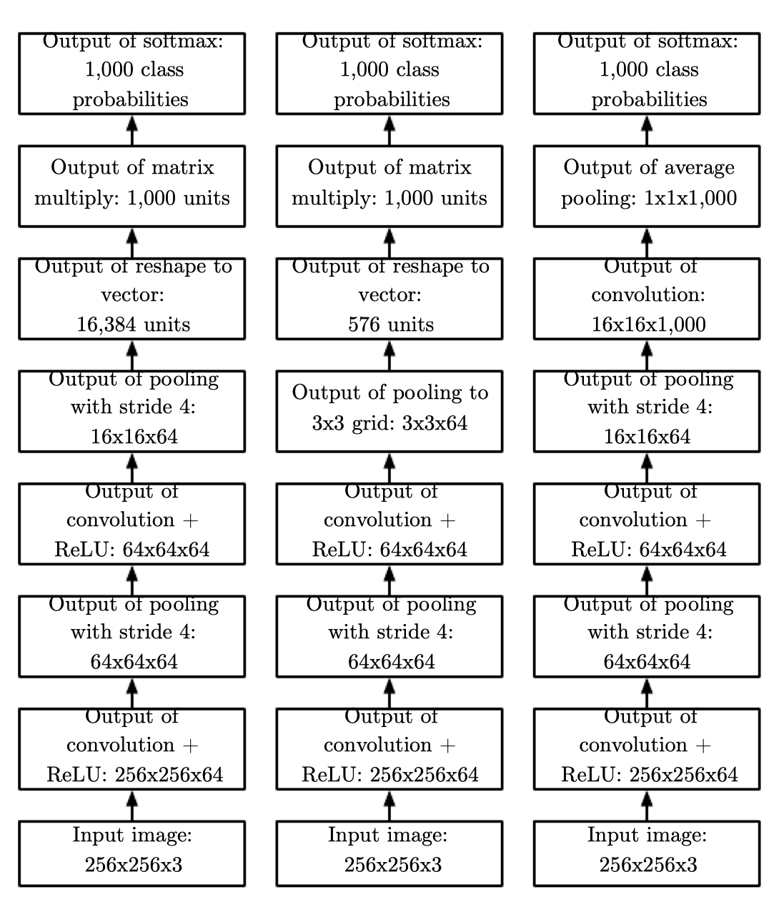
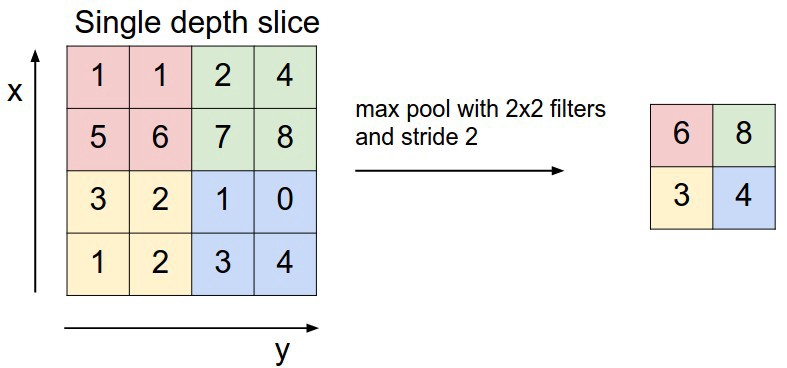
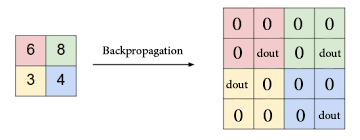

# 9.3池化

池化种类：

- 最大池化（max pooling）
- 相邻矩形区域内的平均值
- L2范数
- 距中心像素距离的加权平均函数

## 平移不变性

不管采用什么样的池化函数，当输入作出少量平移时，池化能够帮助输入的表示近似不变（invariant）。

使用池化可以看做是增加了一个无限强的先验：这一层学得的函数必须具有对少量平移的不变性。

## 学习不变性

使用分离的参数学得多个特征，再使用池化单元进行池化，可以学得对输入的**某些变化**（不一定是平移）的不变性。这里展示三个学得的过滤器和一个最大池化单元，可以学得对旋转变换的不变性。

## 完整网络

左：处理固定大小的图像的卷积网络

中：处理大小可变的图像的卷积网络

右：没有任何全连接权重层的卷积网络

## max pooling反向传播

最大值位置才会有反向传播的误差

# 9.4 卷积与池化作为一种无限强的先验

先验被认为是强或者弱取决于先验中概率密度的集中程度：

- 弱先验具有较高的熵值
- 强先验具有较低的熵值：比如方差较小的高斯分布

一个无限强的先验需要对一些参数的概率置0，并且完全禁止对这些参数赋值，无论数据对于这些参数的值给出了多大的支持。

把卷积神经网络想成具有无限强先验的全连接网络来可以帮助我们更好地洞察卷积神经网络是如何工作：

- 卷积和池化可能导致欠拟合
- 当我们比较卷积模型的统计学习表现时，只能以基准中的其他卷积模型作为比较的对象